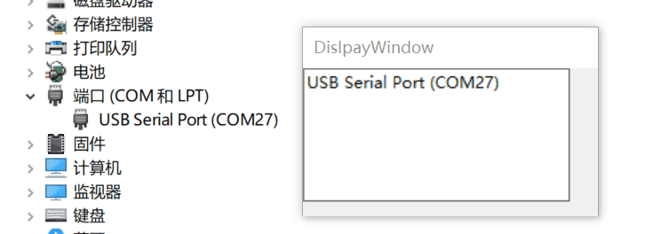

# serial_monitor
en [English](README.md) | zh_CN [简体中文](README.zh_CN.md)

The library is used for monitoring  the insertion and removal of serial port devices on Windows.
The principle is to start a thread to monitor Windows messages.

A demo was released for demonstration [demo](https://github.com/BaoZR/serial_monitor/releases/tag/ui-demo) A library was published for use [lib](https://github.com/BaoZR/serial_monitor/releases/tag/lib)

The main header file is [serial_monitor_lib](/source/lib/serial_monitor_lib.h)
# Function Introduction ：
Function Name     | Description
-------- | -----
device_change_progress | The status callback function of the monitor needs to be passed into the monitor_init initialization function. When a serial device is inserted or pulled out, it returns device status information.
monitor_init | Used to initialize the monitoring listener. Because the listening is single-window, please don't call it repeatedly.
monitor_terminate | Used to destroy the listener.

